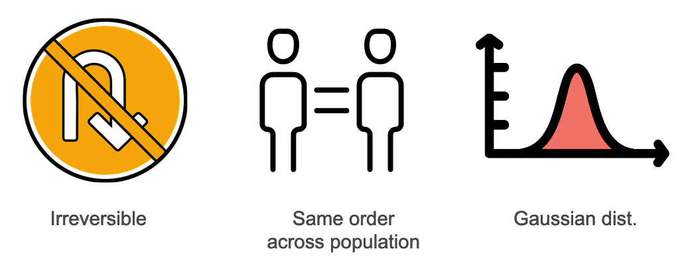

# Introduction

Event-based Model (EBM) is used to model the order of degenerative diseases. In another word, we want to estimate the order in which different biological factors ("biomarkers") get affected by a specific disease. The order is categorized by multiple **stages** in the disease progression. 

For instance, Alzheimer may have the following stages:

{#fig-ad-progression .lightbox width=500}

We estimate this order based on the biomarker data from patients' visits. These data are typically results of neuropsych (e.g., MMSE) and/or biological examiations (e.g., blood pressure). Visits data can be longitudinal and/or cross-sectional, i.e., single visits from a cohort of patients. 

Knowing the disease progression is important because it helps prevent and hopefully cure the disease. It also helps health professionals prepare for the disease's further development.

We have several assumptions in EBM:

{#fig-ebm-assumptions .lightbox width=500}

- The disease is irreversible (i.e., a patient cannot go from stage 2 to stage 1)
- The order in which different biomarkers get affected by the disease is the same across all patients.
- Biomarker data can be approximated by a Gaussian distribution. 

This book contains chapters that explain step by step how we use the event-based model to estimate the order of disease progression based on cross-sectional patients' biomarker data. 