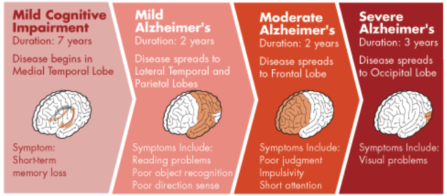

# Introduction

You can also read the material in [PDF](Event-Based-Models-for-Disease-Progression.pdf).

The Event-Based Model (EBM; @fonteijn2012event) is a probabilistic model that can be used to infer the order by which a disease affects the parts of a person's body. In other words, it allows us to estimate the stages by which different biological factors ("biomarkers") are affected by a disease. 

For instance, Alzheimer's may have the following stages:

{#fig-ad-progression .lightbox width=500}

We estimate this order based on the biomarker data from patients' visits. These data are typically results of neuropsych (e.g., MMSE) and/or biological examinations (e.g., blood pressure). Visits data can be longitudinal and/or cross-sectional, i.e., single visits from a cohort of patients. 

Knowing the disease progression is important because it helps prevent and hopefully cure the disease (e.g., to identify critical points for intervention). It also helps health professionals prepare for the disease's further developments.

The EBM has been especially helpful at providing converging support for the stages of neural deterioration of neural degenerative diseases. Neural diseases are notoriously complex for many reasons. For instance, they are difficult to study in vivo due to the challenge of direct and accurate measurement of the brain at high resolution without harming the person.

By formulating the deterioration process as a probabilistic model, the EBM affords the ability to conduct complex reasoning from noisy patient data. Given the difficulty of this task, it is unclear how much (number of participants) and what kind of data (healthy percentage) is needed for reliable estimation and how to best understand the uncertainty of model estimates. 

Although prior work (e.g., @fonteijn2012event, @chen2016staging) has not addressed the former question in great detail, it has derived uncertainty of its estimates indirectly using bootstrapping. In this monograph, we analyze the statistical consistency of different inference methods for the EBM model. To foreshadow, our results are reassuring, yet troubling, and promising. Inference methods used in prior work work well when there is a large number of participants (~500) and the percentage of healthy participants is near 50%. However, clinical studies with such large sample sizes are uncommon and so, in typical settings, the prior approximation methods may be unreliable. We test our own method using Markov chain Monte Carlo techniques and find it provides much more accurate estimates for small sample sizes that are robust across different percentages of healthy participants. The results of our analyses come with a caveat: they are based on simulated data. We discuss this caveat, other limitations, and how to interpret our results in the monograph.

We have several assumptions in EBM:

{#fig-ebm-assumptions .lightbox width=500}

- The disease is irreversible (i.e., a patient cannot go from stage 2 to stage 1)
- The order in which different biomarkers get affected by the disease is the same across all patients.
- Biomarker data can be approximated by a Gaussian distribution. 

::: {.callout-note appearance="simple"}

## Pay Attention

The third assumption, i.e., Gaussian approximation, often will be violated in raw biomarker data. For example, measurements of the concentration of amyloid proteins associated with Alzheimer's disease are necessarily non-negative. Further, their resolution has changed over the decades. 

However, for the purpose of our current method, we assume this is true. There are nonparametric versions of the EBM, for example, [KDE EBM](https://github.com/ucl-pond/kde_ebm)

::: 

This book contains chapters that explain step by step how we use the event-based model to estimate the order of disease progression based on cross-sectional patients' biomarker data. 